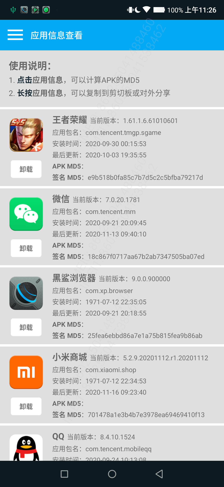

# AndroidAppFactory Sample

## AAF(AndroidAppFactory)介绍

#### 关于AAF

AAF 是在开发过程中，基于组件化方案，逐渐积累的一套 Android 终端开发方案。方案力求做到技术方案可以轻松的从一个项目复用到另一个项目，或者可以快速在框架基础上开发出另一个独立的应用，开发过程中基本聚焦在新业务的逻辑，而不是基础功能。

#### 相关链接

- 主页：[https://android.bihe0832.com](https://android.bihe0832.com)

- AAF 源码：[https://github.com/bihe0832/AndroidAppFactory](https://github.com/bihe0832/AndroidAppFactory)
	
	目前包含了所有公共的基础组件的源码。
	
- 方案介绍：[https://blog.bihe0832.com/android-dev-summary.html](https://blog.bihe0832.com/android-dev-summary.html)

	完整的介绍了整个基于组件化的AAF开发方案。
	
## AndroidAppFactory Sample 介绍

AndroidAppFactory Sample 是所有基于AAF开发的应用的集合。用于日常功能开发，以及AAF相关方案在具体实践中的验证。当前支持的独立应用有：

- APPTest：所有Sample共享的调试模块

- PubGetAPKInfo：获取设备已安装应用基本信息

#### 代码目录

	.
	├── APPTest：所有Sample共享的调试模块
	│
	├── Application：所有Sample共享的框架组件，用于完成初始化等操作
	│
	├── BaseCard：所有Sample共享的UI卡片
	│
	├── PubGetAPKInfo：获取设备已安装应用基本信息的APK的应用组件
	│
	├── build_module.gradle：AAF的构建脚本，完成模块管理
	│
	├── config.gradle：所有Sample共享基础配置
	│
	├── dependencies.gradle：AAF的构建脚本，管理所有模块的依赖
	│
	├── proguard-rules-common.pro：AAF的混淆脚本
	│
	└── settings.gradle：AAF的构建脚本，动态管理模块导入

#### 运行工程

- 环境配置

	根据开发者的Android Studio 版本以及网络环境修改maven依赖等配置。具体设置方法可以参考：[终端基于gradle的开源项目运行环境配置指引](https://blog.bihe0832.com/android-as-gradle-config.html)

- 项目配置

	选择要体验的项目，并在根目录的`dependencies.gradle`调整工程配置，支持对应项目的运行。以`PubGetAPKInfo`为例，需要将`dependencies.gradle`的前几项配置修改为：

		ext.mainProject = "PubGetAPKInfo"
		ext.developModule = "Application"
		ext.pubModuleIsApplication = true

- 启动Android Studio，直接导入工程

- 运行 `PubGetAPKInfo` 模块

#### Demo 列表

- PubGetAPKInfo

	- 下载地址：
		
		https://github.com/bihe0832/AndroidAppFactory-Sample/releases/download/V1.0.0.1/ZAPK_V1.0.0_1_release.apk

		

	- UI 截图

		
